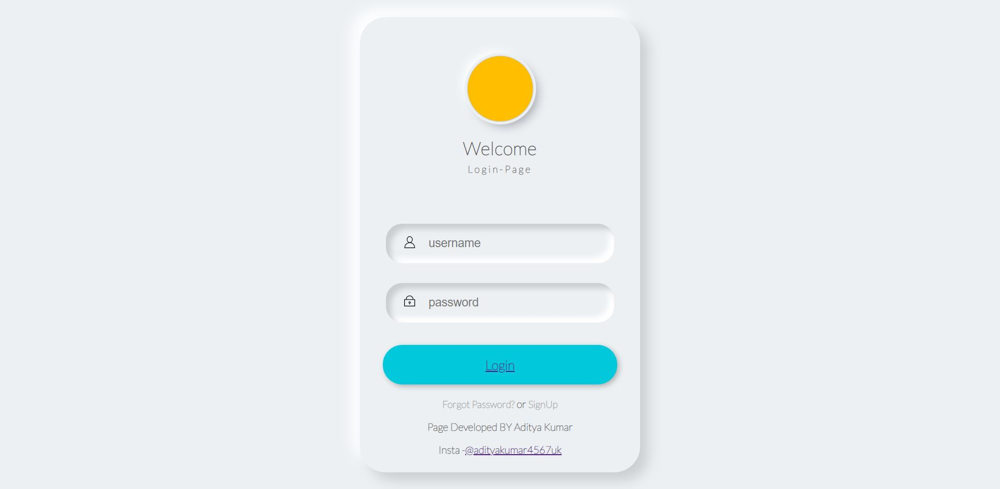
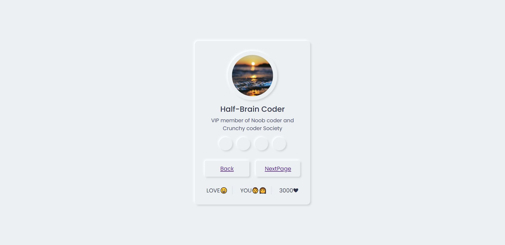
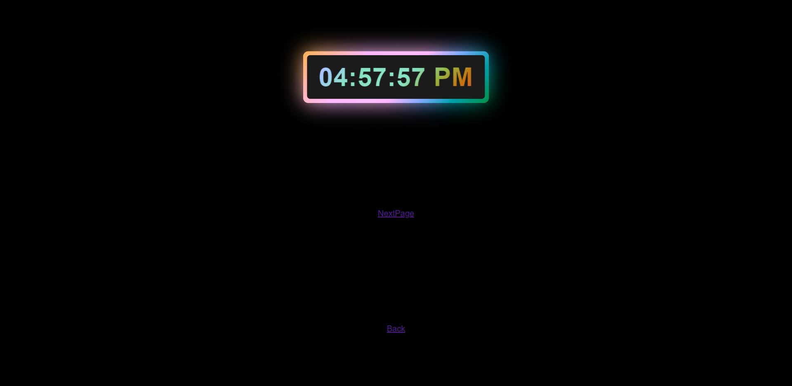
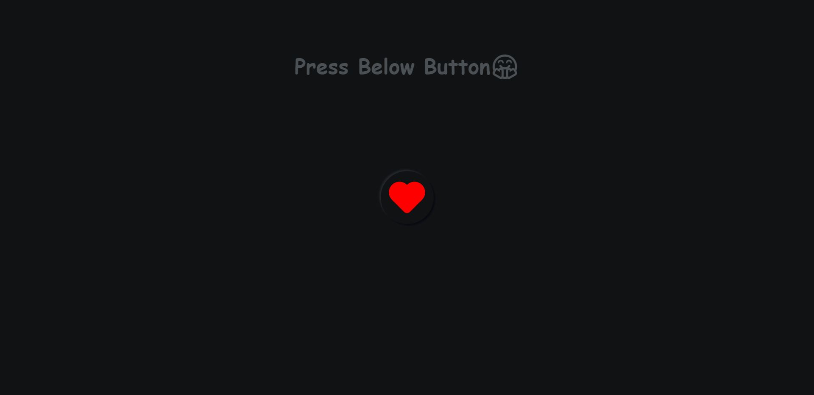

# Neumorphic-design-LOGIN-PAGE
Few set of webpages has been created using HTML CSS &amp; JS , Design pattern followed is "Neumorphism"
<h1>PREVIEWS OF ALL PAGES</h1>
<h2>LOGIN PAGE</h2>

<h2>2ND PAGE</h2>

<h2>RGB GLOW CLOCK</h2>

<h2>NEUMORPHIC RED HEART LIKE BUTTON</h2>

HOPE YOU GUYS LIKE IT , DO GIVE IT A STAR
